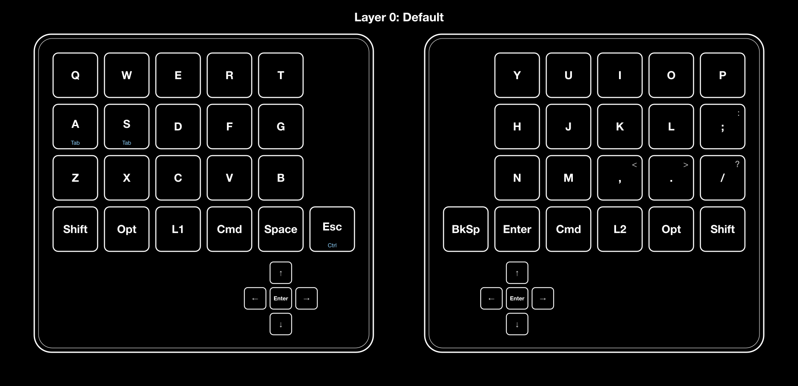
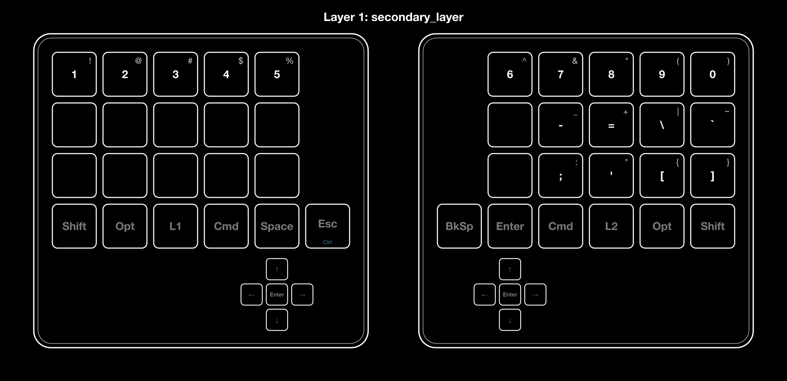
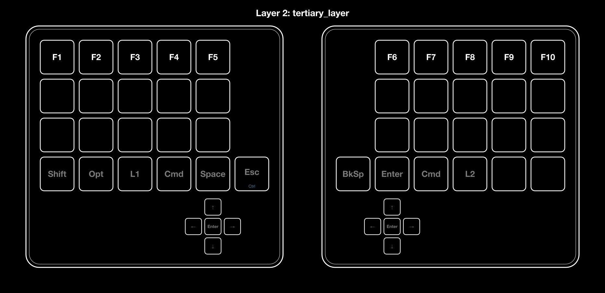
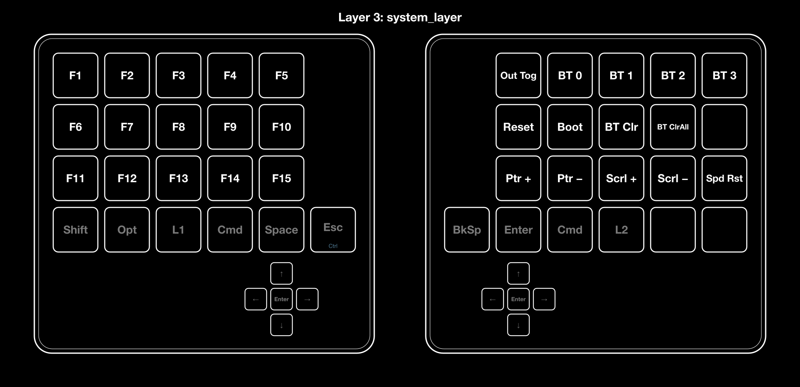

# zmk-config-LalaPadGen2

LalaPad Gen2 用の ZMK ファームウェア設定。

## キーマップ

`config/lalapadgen2.keymap` から `tools/keymap-img` で生成した配列図。

- ホールドタップ: キー下部の水色が hold 側
- キー右上の灰色: Shift 同時押しで入力される記号
- 灰色のキー: 下位レイヤーから引き継いだ割り当て (`&trans`)
- Layer 1 と 2 を同時に有効にすると Layer 3 (system) が有効になる

### Layer 0: Default



### Layer 1: secondary_layer



### Layer 2: tertiary_layer



### Layer 3: system_layer



### 画像の再生成

keymap を変更したら以下を実行して `docs/keymap/` を更新し、一緒にコミットする。CI (`keymap-image`) が keymap と画像の同期をチェックしており、差分があると PR をマージできない。

```sh
python3 tools/keymap-img/render.py
```

詳細は [tools/keymap-img/README.md](tools/keymap-img/README.md) を参照。
